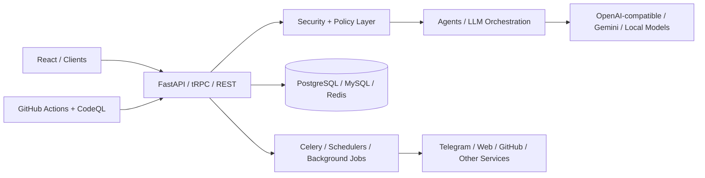

# Hossein Rahimi

### I build secure AI systems, agentic developer tools, and production-grade automation.

**Python · TypeScript · FastAPI · React · AI Agents · Secure Automation · Networks**

 

  

<picture>
  
</picture>

## 👋 About me

I build practical software where **AI, automation, APIs, security, and infrastructure** meet.

My work increasingly focuses on reliable AI systems rather than isolated demos: compatibility layers, agent workflows, review-first automation, security boundaries, observable services, CI/CD, and failure-aware production behavior.

### 🎯 Current focus

**Agentic software engineering · OpenAI-compatible infrastructure · secure human-in-the-loop automation · reliable AI integrations · developer tooling**

## 📊 Impact / proof

| Area | Evidence in public projects |
|---|---|
| **Testing** | 86-test Telegram agent suite, backend/API tests, deterministic fixtures, multi-version Python CI |
| **Security** | SSRF defenses, PII redaction, prompt-injection boundaries, safe defaults, URL policies, CodeQL, dependency review |
| **Reliability** | Retry/backoff, timeouts, readiness probes, atomic persistence, delivery reconciliation, graceful shutdown |
| **Production delivery** | Docker / Compose, GitHub Actions, MySQL/PostgreSQL/Redis, container smoke tests, deployment runbooks |
| **AI infrastructure** | OpenAI-compatible Chat Completions + Responses APIs, streaming, model aliases, tool-call guardrails |
| **Agent systems** | Multi-agent review flows, governed actions, Telegram automation, LLM orchestration, human approval gates |

## 🚀 Flagship projects

| Project | What it demonstrates | Stack | Status |
|---|---|---|---|
| 🧠 **[Notion AI → OpenAI Compatible](https://github.com/HoosseinRahimi/Notion-AI-to-OpenAI-Compatible)** | OpenAI-compatible API layer, Responses API, SSE streaming, concurrency controls, security hardening | Python · FastAPI | **Active · v0.4.0** |
| 🔥 **[ForgeFlow AI](https://github.com/HoosseinRahimi/ForgeFlow-AI)** | AI-native project operations, repository intelligence, governed actions, multi-agent review | FastAPI · React · Docker | **Active · v0.15.0** |
| 📡 **[AI Channel Publisher](https://github.com/HoosseinRahimi/ai-channel-publisher)** | Review-first AI publishing, Telegram automation, delivery reconciliation, analytics | TypeScript · React · tRPC · MySQL | **Active** |
| 🤖 **[Telegram AI Agent Userbot](https://github.com/HoosseinRahimi/telegram-agent-userbot)** | Safe personal-agent automation, LLM routing, prompt boundaries, PII protection | Python · Telethon · Docker | **Active** |
| 🕸️ **[CrawlForge](https://github.com/HoosseinRahimi/crawlforge)** | Responsible distributed extraction with SSRF protection, quotas, workers, observability | FastAPI · Celery · Playwright · Redis · PostgreSQL | **Public portfolio** |
| 🌐 **[CCNA Complex Network Design](https://github.com/HoosseinRahimi/CCNA_Complex_Network_Design)** | Routing, VLANs, NAT, DHCP, ACLs, and network infrastructure design | Cisco Packet Tracer | **Reference project** |

## ⚡ Recent engineering work

### 🧠 Notion AI → OpenAI Compatible · v0.4.0

Added **Responses API support**, timing-safe API-key checks, public-bind protection, atomic state writes, per-session locks, bounded thread reuse, readiness probes, append-only SSE streaming, guarded experimental tools, CI, coverage, Ruff, Pyright, Dependabot, and security/release documentation.

### 📡 AI Channel Publisher

Hardened production delivery with **delivery reconciliation**, database-backed delivery attempts, safe remote-URL validation, LLM timeouts and transient-error retries, CodeQL, dependency review, MySQL-backed CI, production builds, and container smoke tests.

### 🤖 Telegram AI Agent Userbot

Added **safe defaults**, allowlists, dry-run mode, per-chat locks, global concurrency limits, PII redaction, prompt-injection isolation, sensitive-data detection, retry/backoff, atomic persistence, non-root Docker execution, graceful shutdown, and an **86-test** suite.

### 🔥 ForgeFlow AI · v0.15.0

Expanded the Community Edition with a **seven-role multi-agent review demo**, project-health signals, repository retrieval over public documentation, deterministic debugging, and a governed **propose → approve/reject** action flow.

**[▶ Open the live ForgeFlow AI showcase](https://hoosseinrahimi.github.io/ForgeFlow-AI/)**

## 🧩 Architecture snapshot

The recurring pattern is deliberate: **typed boundaries → deterministic controls → AI assistance → explicit approval where risk matters → observable execution**.

## 🛡️ Security & reliability

I treat security and failure handling as architecture, not cleanup work.

- **Fail-safe defaults:** automation can start disabled, dry-run, allowlisted, or approval-gated.
- **Input boundaries:** prompt-injection isolation, schema validation, content filtering, and PII redaction.
- **Network safety:** SSRF protections, private-address rejection, redirect validation, and safer remote URL policies.
- **Operational resilience:** timeouts, retry/backoff, concurrency limits, atomic persistence, readiness/liveness checks, and graceful shutdown.
- **Delivery correctness:** idempotency-aware workflows and explicit reconciliation for ambiguous external-service outcomes.
- **Supply-chain hygiene:** CI, CodeQL, dependency review, Dependabot, linting, type checking, tests, and container smoke tests.

## 🌍 Open-source work

- **[book-to-skill](https://github.com/virgiliojr94/book-to-skill)**: contributed merged support for [project-local skill paths](https://github.com/virgiliojr94/book-to-skill/pull/210) and [OpenClaw skill discovery and validation](https://github.com/virgiliojr94/book-to-skill/pull/209).
- Additional public contribution work is visible across my repositories and pull requests.

## 🧭 Engineering focus

- 🤖 Agentic systems and LLM orchestration
- 🔌 OpenAI-compatible APIs and compatibility layers
- 🛡️ Security-first automation and human approval gates
- 🧩 Production-style full-stack systems and developer tooling
- ⚙️ Testing, CI/CD, observability, containers, and reliable operations
- 🌐 Networks, distributed services, protocols, and infrastructure

## 🧰 Tech stack

**AI & APIs:** LLM integrations · OpenAI-compatible APIs · Responses API · streaming · tool-call guardrails · agent workflows  
**Backend:** FastAPI · Express · tRPC · REST · PostgreSQL · MySQL · SQLite · Drizzle ORM  
**Frontend:** React · TypeScript · Vite  
**Infrastructure:** Docker · Docker Compose · Redis · Celery · GitHub Actions · CodeQL · Linux · Git  
**Security:** SSRF defenses · PII redaction · rate limiting · retry/backoff · readiness checks · atomic state · dependency review  
**Networks:** TCP/IP · VLANs · routing · NAT · DHCP · ACLs · Cisco Packet Tracer

## 🖼️ Visual portfolio

  

Profile assets: [X banner](./assets/x-profile-banner.png) · [Telegram avatar](./assets/telegram-agent-avatar.png) · [Resume header](./assets/resume-header.png) · [Website OG image](./assets/website-og-image.png) · [Tutorial thumbnail](./assets/technical-tutorial-thumbnail.png) · [Email signature](./assets/email-signature-banner.png)

## 📍 Find me on GitHub

 

Build → test → harden → observe → improve → repeat.

