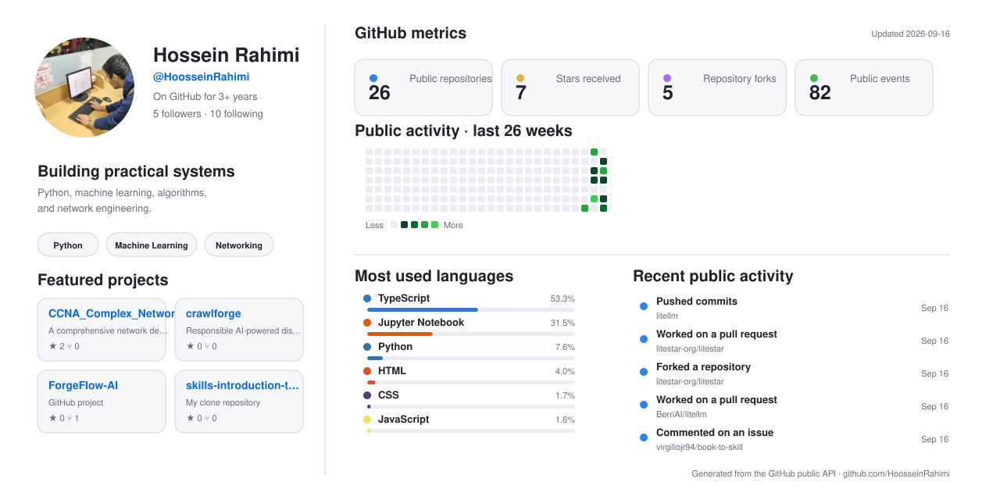

# Hossein Rahimi

### Building practical tools across code, data, and networks

Python · TypeScript · AI & data · Algorithms · Network engineering

 

<picture>
  
</picture>

## About me

I build practical, documented projects across full-stack AI, Python, data, algorithms, and computer networks. I care about making the result understandable and verifiable, not just getting a script to run once.

My current toolkit is centred around:
`Python` · `TypeScript` · `React` · `Node.js` · `Docker` · `Jupyter` · `Pandas` · `scikit-learn` · `Streamlit` · `GitHub Actions` · `Cisco Packet Tracer` · `Git`

## Featured work

<table>
  <tr>
    <td width="34%" valign="top">
      <h3>🤖 AI & Data</h3>
      <a href="https://github.com/HoosseinRahimi/ai-channel-publisher"><strong>AI Channel Publisher</strong></a> 
      A self-hosted full-stack AI publishing system with React, tRPC/Express, MySQL/Drizzle, OpenAI-compatible models, Telegram delivery, scheduled draft review, encrypted credentials, and engagement analytics.
        
      <a href="https://github.com/HoosseinRahimi/airbnb-project"><strong>Amsterdam Airbnb Explorer</strong></a> 
      An interactive Streamlit dashboard for exploring Amsterdam listings by budget and distance, with an automated app health check. 
      <strong><a href="https://amsterdam-airbnb-explorer.streamlit.app/">▶ Live Demo</a></strong>
        
      <a href="https://github.com/HoosseinRahimi/fake-news-detection-nlp"><strong>Fake News Detection - NLP Contribution</strong></a> 
      My NLP and CNN experimentation for a collaborative fake-news detection project, including text preprocessing and optimizer comparisons. 
      <small>Team repository: <a href="https://github.com/hosseindamavandi/Fake-News-Detection">Fake News Detection</a></small>
        
      <a href="https://github.com/HoosseinRahimi/Bulldozer-price-prediction"><strong>Bulldozer Price Prediction</strong></a> 
      A regression project with data preparation, feature engineering, and historical auction-price prediction.
    </td>
    <td width="33%" valign="top">
      <h3>🧠 Algorithms</h3>
      <a href="https://github.com/HoosseinRahimi/Rat-in-maze"><strong>Rat in a Maze</strong></a> 
      Tested pathfinding implementations using BFS, A*, DFS, and backtracking, with automated regression checks.
        
      <a href="https://github.com/HoosseinRahimi/kosaraju-algorithm"><strong>Kosaraju SCC</strong></a> 
      An iterative implementation of Kosaraju's algorithm supporting arbitrary vertex IDs, with automated tests.
    </td>
    <td width="33%" valign="top">
      <h3>🌐 Networks</h3>
      <a href="https://github.com/HoosseinRahimi/university-network"><strong>University Network</strong></a> 
      A repaired and validated Cisco Packet Tracer campus network with VLANs, DHCP, wireless, DNS, NAT, and end-to-end connectivity checks.
        
      <a href="https://github.com/HoosseinRahimi/CCNA_Complex_Network_Design"><strong>CCNA Complex Network Design</strong></a> 
      A practical multi-service topology covering VLANs, routing, NAT, DHCP, ACLs, and server integration.
    </td>
  </tr>
</table>

## Engineering focus

- Building production-style full-stack AI systems with clear operational boundaries
- Building reproducible and well-documented Python and TypeScript projects
- Applying data analysis and machine learning to practical datasets
- Testing algorithm implementations and documenting correctness
- Designing and troubleshooting real-world network topologies

## Find me

 

<i>Thanks for stopping by - feel free to explore the projects.</i>

